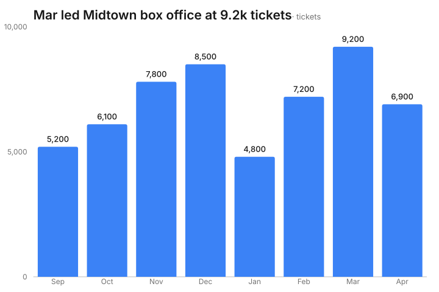

<p align="center">
  
</p>

# markvis

[](https://github.com/geekplux/markvis/actions/workflows/check.yml)

**Charts in Markdown. The numbers are the picture.**

Write a table in a Markdown code block. MarkVis draws the chart. Change a number — the picture changes. If the chart cannot draw, you still see the table.

You do not need to know what “IR” means. A **fence** is just a fenced code block tagged `chart` (or `markvis`, or `vis`). The numbers live in that block. That is the whole idea.

In 2017 this project was a renderer (GitHub Trending). This is the rewrite: the same name, for people and for AI.

**Try:** [Play](https://markvis.js.org/play) · [Examples](https://markvis.js.org/examples) · [For AI](https://markvis.js.org/llms.txt)


## An example

Paste this into [Play](https://markvis.js.org/play). Six kinds: bar, line, area, scatter, pie, hist. Optional look: `theme` and `palette` — [SPEC.md](./SPEC.md).

```chart
markvis: 2
type: bar
title: Mar led Midtown box office at 9.2k tickets
unit: tickets
x: month
y: tickets

month,tickets
Sep,5200
Oct,6100
Nov,7800
Dec,8500
Jan,4800
Feb,7200
Mar,9200
Apr,6900
```


You can also put the numbers in a Markdown table, or use the HTML comment form in [`examples/valid/08-bar-comment.md`](./examples/valid/08-bar-comment.md).

## Try it today

1. **Play** — paste a block at [markvis.js.org/play](https://markvis.js.org/play). No install.

2. **Install** — `2.0.0` replaces `0.0.13` (the old d3 renderer stays in [legacy/](./legacy/)).

   ```bash
   npm install markvis
   npx markvis bake README.md
   ```

   `bake` writes a picture next to the file and adds a Markdown image so GitHub can show it. The code block stays. Running bake again does nothing if nothing changed. `npx markvis check notes.md` makes sure every chart block is valid.

   ```js
   import { parseMarkdown, renderSvg } from "markvis";

   const parsed = parseMarkdown(markdown);
   if (parsed.ok) {
     const svg = renderSvg(parsed.chart);
   } else {
     // parsed.table still has the rows; parsed.error.code is stable
   }
   ```

3. **In a Markdown site** — remark **or** markdown-it. Both return the picture and the data table:

   ```js
   import MarkdownIt from "markdown-it";
   import markdownItMarkvis from "markvis/markdown-it";

   const html = new MarkdownIt({ html: true })
     .use(markdownItMarkvis)
     .render(markdown);
   // html contains <svg> and <table>
   ```

   ```js
   import { remark } from "remark";
   import remarkHtml from "remark-html";
   import remarkMarkvis from "markvis/remark";

   const html = String(
     await remark()
       .use(remarkMarkvis)
       .use(remarkHtml, { sanitize: false })
       .process(markdown),
   );
   ```

4. **With an AI** — point a model at [skills/markvis/SKILL.md](./skills/markvis/SKILL.md) or [llms.txt](./llms.txt). It should write only the fields listed there. Not a PNG. Not a seventh chart kind.

## What you can write

| | |
| --- | --- |
| Code block tags | `chart` `markvis` `vis` |
| Chart kinds | `bar` `line` `area` `scatter` `pie` `hist` |
| Fields | `markvis` `type` `title` `unit` `x` `y` `series` plus `theme` `palette` |
| Numbers | Comma-separated rows, or one Markdown table. Not JSON as the default. No JavaScript in the block. |

`theme:` how it is drawn: `folio` (default) `highcharts` `shadcn` `docs` `ant` `recharts`. `palette:` colors only: `ink` `porcelain` `warm` `cool` `vivid`. Unknown look → table + error, never a silent swap. Pie slices are not forced to 100. Rows stay in the order you wrote them.

## Docs

[Get started](https://markvis.js.org/get-started) · [Integrate](./docs/integrate.md) · [SPEC.md](./SPEC.md) · [Themes](./docs/themes.md) · [Architecture](./docs/architecture.md) · [Contributing](./CONTRIBUTING.md) · [Release / merge](./docs/release.md)

0.0.13 (the old d3 renderer): [legacy/](./legacy/).
