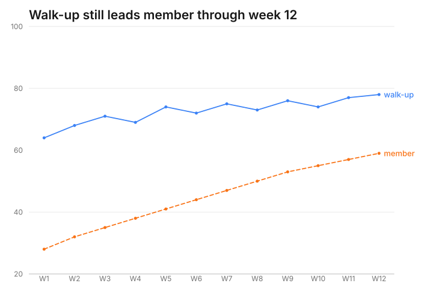
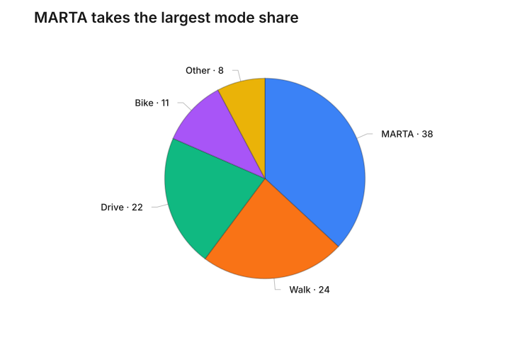

# markvis

Charts in Markdown. The fence is the data.

**Try:** [https://markvis.js.org/play](https://markvis.js.org/play) · [examples](https://markvis.js.org/examples.html)

Tags: `chart` | `markvis` | `vis`. Types: bar · line · area · scatter · pie · hist.

Bake for GitHub: `markvis bake README.md`. Browser: `packages/browser/dist/markvis.min.js`. Spec · integrate · themes: [docs](./docs/site-copy.md).

0.0.13 (frozen): [legacy/](./legacy/). Branch `v2`.
