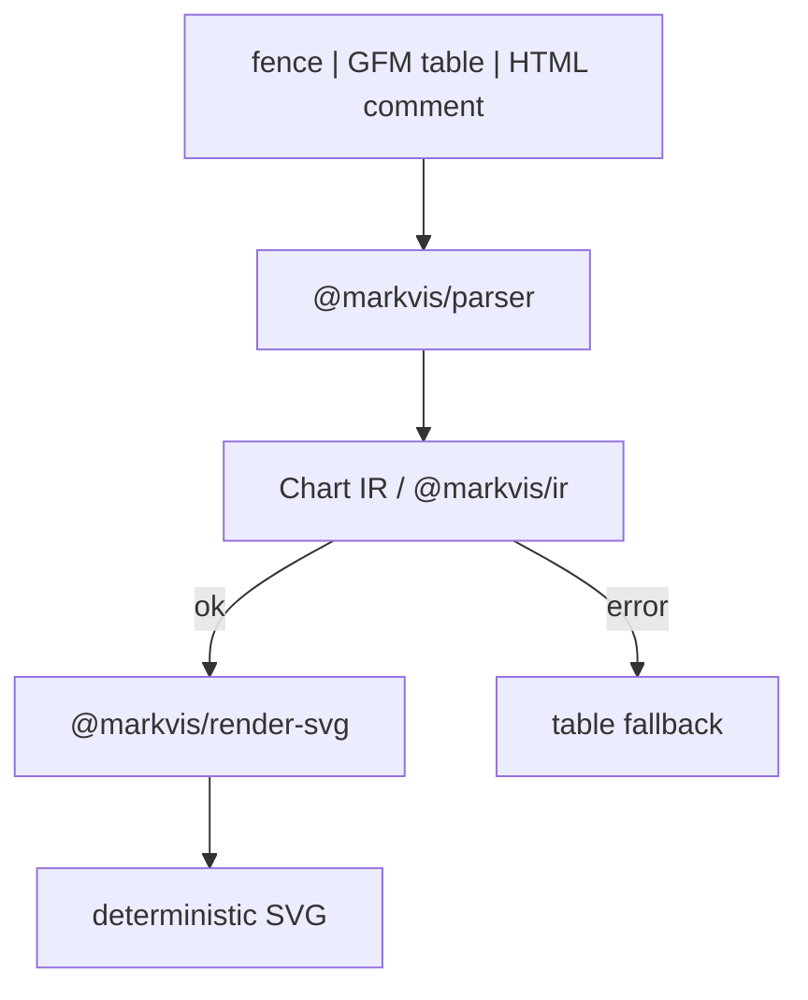
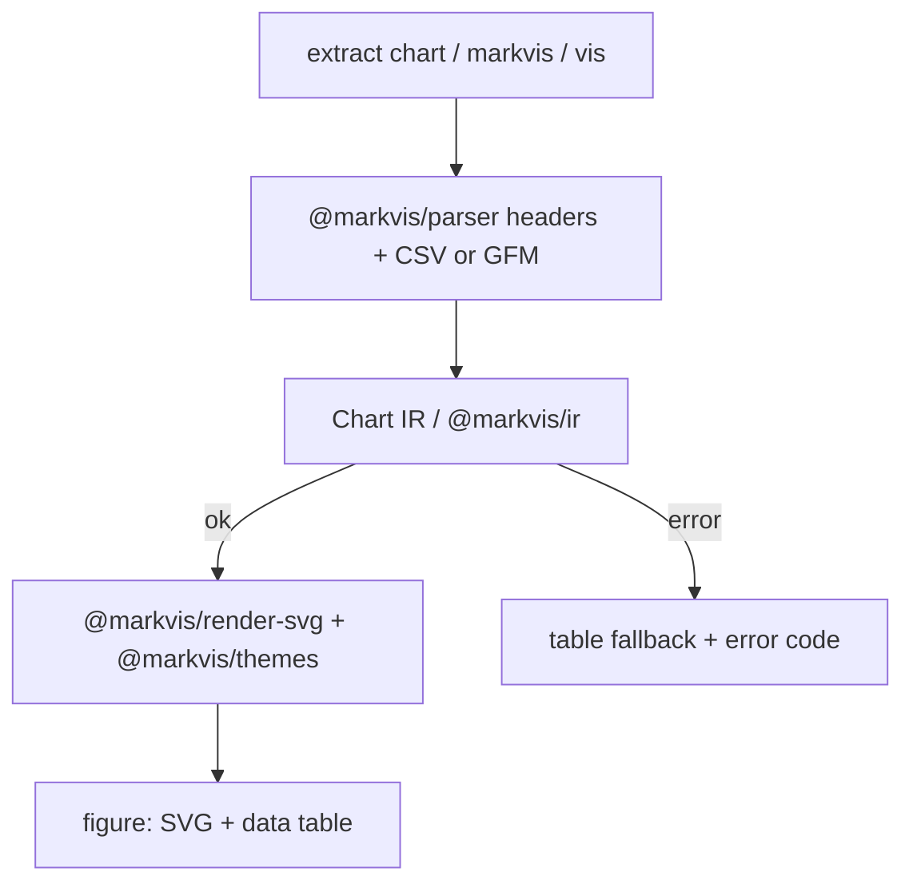
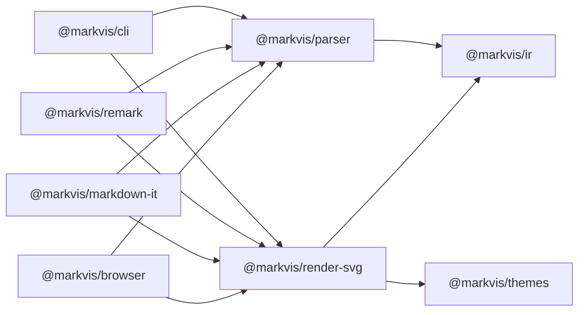

# Architecture

How markvis turns Markdown into a figure. Grammar lives in `SPEC.md`. Types stay `bar` `line` `area` `scatter` `pie` `hist`. Data is CSV or a GFM table. JSON is not the default data form. Failures keep the rows.

## Architecture

Hosts see a fence (`chart` / `markvis` / `vis`), a GFM table, or an HTML comment plus table. One parser builds Chart IR. `@markvis/render-svg` draws deterministic SVG. On error the rows become a table fallback plus one stable error code.

## Parse / render workflow

1. Extract a `chart` / `markvis` / `vis` fence, or a progressive HTML comment immediately followed by a GFM table.
2. Parse header fields (`type`, optional `theme`, optional `palette`, `title`, `unit`, `x`, `y`, `series`) then CSV or GFM rows. Keep input row order.
3. Validate against Chart IR (`@markvis/ir` + `schema/markvis-2.schema.json`). Unknown `theme:` → `E_UNKNOWN_THEME`. Unknown `palette:` → `E_UNKNOWN_PALETTE`.
4. Success: `@markvis/render-svg` resolves `@markvis/themes` tokens and emits the same SVG bytes for the same IR.
5. Failure: table fallback of recovered rows plus one line that names the error code. Never drop the numbers.

## Package / code structure

| Package | Role |
| --- | --- |
| `@markvis/ir` | Chart IR + JSON Schema |
| `@markvis/parser` | Fence / GFM / HTML comment → IR or error |
| `@markvis/themes` | Named grammar packs + palettes |
| `@markvis/render-svg` | IR → deterministic SVG |
| `@markvis/cli` | `check` / `render` / `bake` / `stats` |
| `@markvis/remark` | remark host plugin |
| `@markvis/markdown-it` | markdown-it / VitePress plugin |
| `@markvis/browser` | Zero-network drop-in + SVG enhance |
| `packages/compat-legacy` | Optional, default off |
| `apps/playground` | Fence in, figure out |
| `apps/web` | Public VitePress site |
| `legacy/` | Frozen 0.0.13. Not imported by `packages/*` tests |

Root `markvis` re-exports the packages and owns the `markvis` bin.
